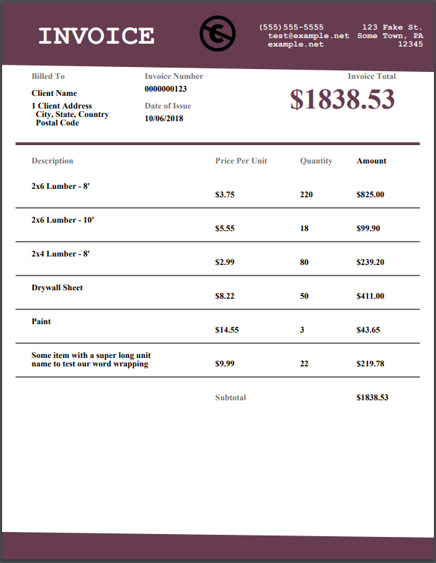

# Gophercises - 20 - Building PDFs

## Problem

* https://github.com/gophercises/pdf
* https://gophercises.com/exercises/pdf

## Solution

* [main.go](main.go): Certificate of completion.
* [learn-gofpdf/main.go](learn-gofpdf/main.go): Learning how the package works.
* [corp](corp): Contains a corp package that is used to create invoices.
    * [consts.go](corp/consts.go): Constants used in the PDF. Pretty much every position and color in the PDF is customizable here.
    * [invoice.go](corp/invoice.go): Invoice represents an invoice. Inside each invoice add client information and a slice of items. For each item, add description, amount, and price per unit. Everything else is calculated automatically (or with methods).
    * [corp.go](corp/corp.go): Has methods for generating the invoice PDF. Different methods for page banner and footer, invoice header, and item list.
* [generate-invoice/main.go](generate-invoice/main.go): Generates an invoice almost exactly as the one in the example using the corp package. Look at main for usage of the corp package.

## Generated Invoice
See image of generate invoice by [generate-invoice/main.go](generate-invoice/main.go). See a copy at [generate-invoice/invoice.go](generate-invoice/invoice.go)



## Lessons Learned

### gofpdf Package
See inside [gofpdflearn/main.go](gofpdflearn/main.go).

### Access Struct Fields with the Reflect Package
Don't use `relfection` I guess. But this is fun.

In this case, our struct only has string fields so we only check for empty string.

``` go
v := reflect.ValueOf(c)
for i := 0; i < v.NumField(); i++ {
    if v.Field(i).Interface() == "" {
        return fmt.Errorf("Corp not initialized. Set value of %s", v.Type().Field(i).Name)
    }
}
```

We can access the value of a field with `v.Field(i).Interface()` and its name with `v.Type().Field(i).Name`.

### Convert Float to String with Two Floating Points
Change `2` to get more floating points.

``` go
func FloatToString(f float64) string {
	return strconv.FormatFloat(f, 'f', 2, 64)
}
```

## Corp Package Usage
Sample usage to generate the invoice PDF for the lesson.

``` go
package main

import (
	"fmt"

	"github.com/jung-kurt/gofpdf"
	"github.com/parsiya/Parsia-Code/gophercises/20-pdf/corp"
)

func main() {

	// Create a new corporation.
	co := corp.Company{
		Address: `123 Fake St.
		Some Town, PA
		12345`,
		ContactInfo: `(555)555-5555
		test@example.net
		example.net`,
		Logo: "img/logo.png",
	}

	// Create a new invoice.
	in := corp.Invoice{
		ClientName: "Client Name",
		ClientAddress: `1 Client Address
		City, State, Country
		Postal Code`,
		InvoiceNumber: "0000000123",
		Date:          "10/06/2018",
	}

	// Create items.
	it := []corp.Item{
		{
			"2x6 Lumber - 8'", 3.75, 220,
		},
		{
			"2x6 Lumber - 10'", 5.55, 18,
		},
		{
			"2x4 Lumber - 8'", 2.99, 80,
		},
		{
			"Drywall Sheet", 8.22, 50,
		},
		{
			"Paint", 14.55, 3,
		},
		{
			"Some item with a super long unit name to test our word wrapping",
			9.99, 22,
		},
	}

	// Add items to invoice.
	for _, i := range it {
		if err := in.AddItem(i); err != nil {
			panic(err)
		}
	}

	// Change papersize to letter because 'Murica is special!
	pdf := gofpdf.New(gofpdf.OrientationPortrait, gofpdf.UnitPoint, gofpdf.PageSizeLetter, "")

	// Set Header.
	if err := co.SetHeader(pdf); err != nil {
		panic(err)
	}
	co.SetFooter(pdf)

	pdf.AddPage()
	pdf.MoveTo(0, 0)

	// Draw invoice header.
	if err := co.InvoiceHeader(pdf, in); err != nil {
		panic(err)
	}

	// Draw item list.
	if err := co.ItemList(pdf, in); err != nil {
		panic(err)
	}

	// corp.DrawGrid(pdf)
	if err := pdf.OutputFileAndClose("invoice.pdf"); err != nil {
		panic(err)
	}
	fmt.Println("Done")
}
```


